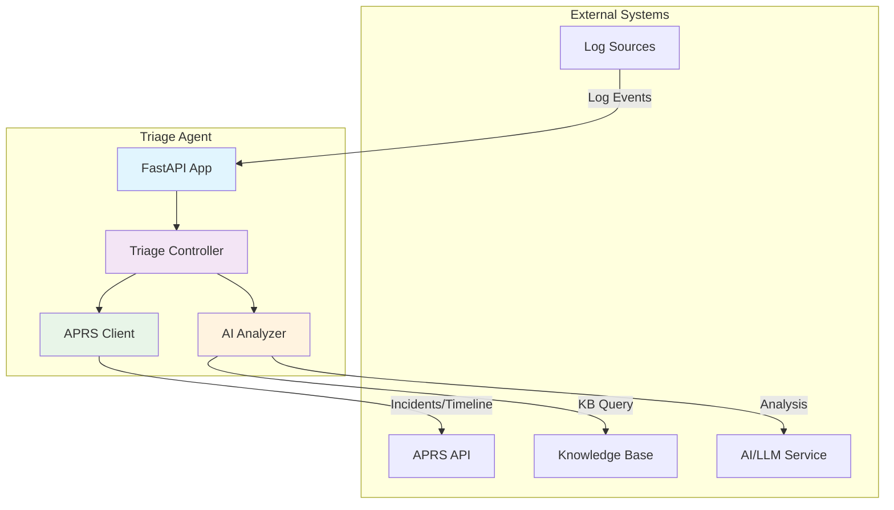
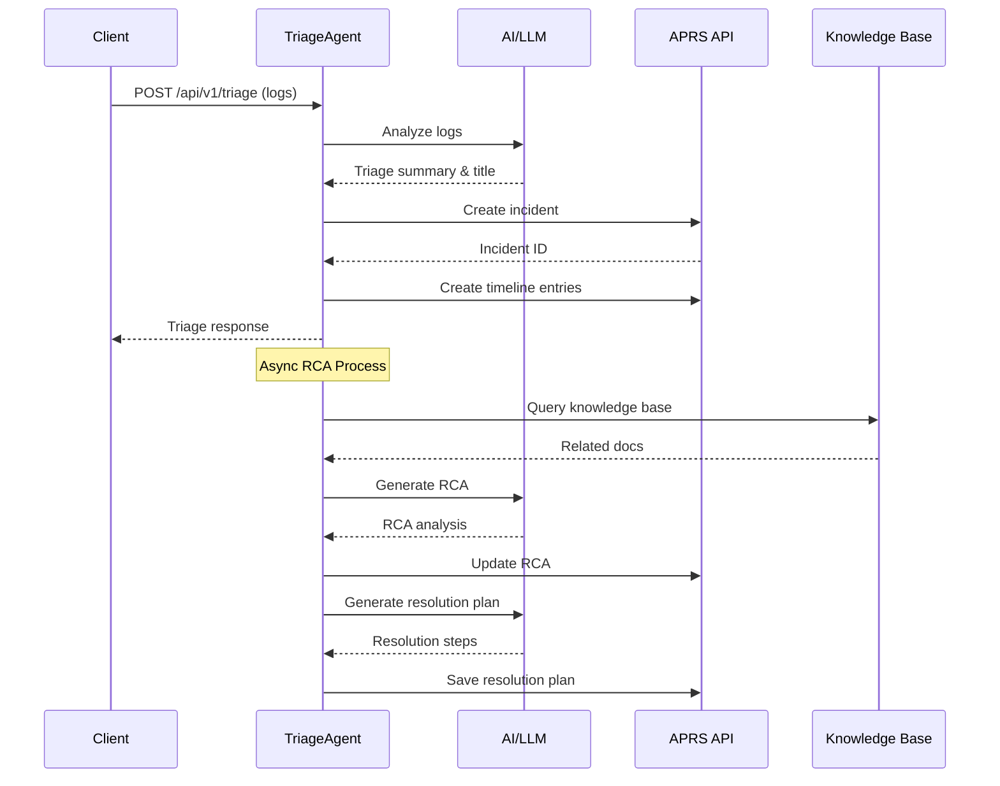

# Triage Agent

An intelligent REST API-based agent for triaging incoming log streams and managing incidents through automated problem resolution workflows.

## 📋 Table of Contents

- [System Overview](#system-overview)
- [Architecture](#architecture)
- [Prerequisites](#prerequisites)
- [Installation](#installation)
- [Configuration](#configuration)
- [Running the System](#running-the-system)
- [API Documentation](#api-documentation)
- [Deployment](#deployment)
- [Development](#development)
- [Troubleshooting](#troubleshooting)

## 🎯 System Overview

The Triage Agent is a FastAPI-based microservice that:

1. **Receives log streams** from various services
2. **Analyzes logs** using AI (LiteLLM) to identify incidents
3. **Creates incidents** in an APRS (Automated Problem Resolution System)
4. **Manages incident timelines** with automated entries
5. **Generates resolution plans** with step-by-step procedures
6. **Performs root cause analysis** with AI assistance

### Key Features

- 🤖 **AI-Powered Analysis**: Uses LiteLLM for intelligent log analysis
- 📊 **Incident Management**: Full integration with APRS API
- 📈 **Timeline Tracking**: Automated incident timeline entries
- 🔍 **Root Cause Analysis**: AI-driven RCA with knowledge base integration
- 📋 **Resolution Planning**: Step-by-step resolution procedures with AWS CLI commands
- 🏥 **Health Monitoring**: Built-in health check endpoints
- 🚀 **Production Ready**: Gunicorn-based deployment with multiple workers

## 🏗️ Architecture

### High-Level Architecture



### System Flow



## 🔧 Prerequisites

### System Requirements

- **Python**: 3.12 or higher
- **Operating System**: Linux, macOS, or Windows
- **Memory**: Minimum 2GB RAM (4GB recommended)
- **Storage**: 1GB free space

### External Dependencies

- **APRS API**: Must be accessible and configured
- **AI/LLM Service**: OpenAI, Azure OpenAI, or compatible service
- **Knowledge Base**: Optional but recommended for enhanced RCA

### Tools Required

- **uv** (Python package manager) - [Installation Guide](https://docs.astral.sh/uv/)
- **just** (Command runner) - [Installation Guide](https://github.com/casey/just)

## 📦 Installation

### 1. Clone the Repository

```bash
git clone <repository-url>
cd triage-agent
```

### 2. Install Dependencies

Using uv (recommended):
```bash
uv sync
```

Or using pip:
```bash
pip install -e .
```

### 3. Development Dependencies

For development work:
```bash
uv sync --group dev
```

## ⚙️ Configuration

### Environment Variables

Create a `.env` file in the project root:

```env
# AI/LLM Configuration
OPENAI_API_KEY=your_openai_api_key
# OR for Azure OpenAI
AZURE_OPENAI_API_KEY=your_azure_key
AZURE_OPENAI_ENDPOINT=your_azure_endpoint

# APRS Configuration
APRS_BASE_URL=https://your-aprs-instance.com/api

# Application Configuration
HOST=0.0.0.0
PORT=8000
LOG_LEVEL=info
```

### Application Settings

The system uses these configurable constants in `app/app.py`:

```python
APRS_BASE_URL = "https://96ef-202-54-141-35.ngrok-free.app/api"
TRIAGE_AUTHOR = "triage_agent"
DIAGNOSIS_AGENT_AUTHOR = "diagnosis-agent"
DEFAULT_ASSIGNEE = "John Doe"
RCA_DELAY_SECONDS = 5
```

Modify these values as needed for your environment.

## 🚀 Running the System

### Development Mode

#### Using Just (Recommended)

```bash
just gunicorn
```

#### Using Gunicorn Directly

```bash
gunicorn -c app/gunicorn_config.py app.app:app
```

#### Using Uvicorn (Development)

```bash
uvicorn app.app:app --reload --host 0.0.0.0 --port 8000
```

### Production Mode

The system is configured for production using Gunicorn with the following settings:

- **Workers**: 5
- **Threads**: 10 per worker
- **Worker Class**: UvicornWorker (async support)
- **Bind**: 0.0.0.0:8000
- **Timeout**: 600 seconds
- **Keep-alive**: 5 seconds

### Verify Installation

Check if the system is running:

```bash
curl http://localhost:8000/health
```

Expected response:
```json
{
  "status": "healthy",
  "timestamp": "2024-01-01T00:00:00.000000"
}
```

## 📚 API Documentation

### Base URL

```
http://localhost:8000
```

### Endpoints

#### 1. Triage Logs

**POST** `/api/v1/triage`

Analyzes log events and creates incidents in APRS.

**Request Body:**
```json
[
  {
    "timestamp": "2024-01-01T12:00:00Z",
    "message": "Database connection failed",
    "level": "ERROR",
    "service": "user-service",
    "trace_id": "abc123"
  }
]
```

**Response:**
```json
{
  "triage_summary": "Database connectivity issue detected in user-service",
  "triage_title": "Database Connection Failure - User Service"
}
```

#### 2. Resolution Plan

**POST** `/api/v1/resolution-plan`

Generates step-by-step resolution plans for incidents.

**Request Body:**
```json
{
  "incident_id": "incident-123",
  "rca_title": "Database Connection Issue",
  "rca_summary": "Connection pool exhausted due to high load",
  "logs": [
    {
      "timestamp": "2024-01-01T12:00:00Z",
      "message": "Database connection failed",
      "level": "ERROR",
      "service": "user-service",
      "trace_id": "abc123"
    }
  ]
}
```

**Response:**
```json
{
  "resolution_plan": [
    {
      "step_number": 1,
      "step_procedure": "Check database connection pool status",
      "step_aws_cli_command": "aws rds describe-db-instances --db-instance-identifier mydb"
    }
  ],
  "confidence_score": 85
}
```

#### 3. Health Check

**GET** `/health`

Returns system health status.

**Response:**
```json
{
  "status": "healthy",
  "timestamp": "2024-01-01T12:00:00.000000"
}
```

### Interactive API Documentation

Once the system is running, access the interactive API documentation:

- **Swagger UI**: http://localhost:8000/docs
- **ReDoc**: http://localhost:8000/redoc

## 🚢 Deployment

### Docker Deployment

Create a `Dockerfile`:

```dockerfile
FROM python:3.12-slim

WORKDIR /app

COPY pyproject.toml uv.lock ./
RUN pip install uv && uv sync --frozen

COPY . .

EXPOSE 8000

CMD ["gunicorn", "-c", "app/gunicorn_config.py", "app.app:app"]
```

Build and run:
```bash
docker build -t triage-agent .
docker run -p 8000:8000 --env-file .env triage-agent
```

### Kubernetes Deployment

Create deployment manifests:

```yaml
apiVersion: apps/v1
kind: Deployment
metadata:
  name: triage-agent
spec:
  replicas: 3
  selector:
    matchLabels:
      app: triage-agent
  template:
    metadata:
      labels:
        app: triage-agent
    spec:
      containers:
      - name: triage-agent
        image: triage-agent:latest
        ports:
        - containerPort: 8000
        env:
        - name: OPENAI_API_KEY
          valueFrom:
            secretKeyRef:
              name: triage-secrets
              key: openai-api-key
---
apiVersion: v1
kind: Service
metadata:
  name: triage-agent-service
spec:
  selector:
    app: triage-agent
  ports:
  - port: 80
    targetPort: 8000
  type: LoadBalancer
```

### Cloud Deployment

#### AWS ECS/Fargate

1. Build and push Docker image to ECR
2. Create ECS task definition
3. Deploy to ECS cluster

#### Google Cloud Run

```bash
gcloud run deploy triage-agent \
  --image gcr.io/your-project/triage-agent \
  --platform managed \
  --region us-central1 \
  --allow-unauthenticated
```

## 🔧 Development

### Project Structure

```
triage-agent/
├── app/
│   ├── __init__.py
│   ├── app.py              # Main FastAPI application
│   ├── models.py           # Pydantic models
│   └── gunicorn_config.py  # Gunicorn configuration
├── pyproject.toml          # Project dependencies
├── uv.lock                 # Dependency lock file
├── justfile                # Command runner recipes
└── README.md               # This file
```

### Development Commands

Install development dependencies:
```bash
uv sync --group dev
```

Run in development mode:
```bash
uvicorn app.app:app --reload
```

Kill processes on port 8000:
```bash
uv run killport 8000
```

### Code Quality

The project uses:
- **FastAPI**: Modern, fast web framework
- **Pydantic**: Data validation and serialization
- **LiteLLM**: Universal LLM interface
- **Loguru**: Advanced logging
- **HTTPX**: Async HTTP client

### Testing

Add test endpoints to verify functionality:

```bash
# Test triage endpoint
curl -X POST http://localhost:8000/api/v1/triage \
  -H "Content-Type: application/json" \
  -d '[{
    "timestamp": "2024-01-01T12:00:00Z",
    "message": "Database connection failed",
    "level": "ERROR",
    "service": "user-service",
    "trace_id": "abc123"
  }]'
```

## 🔍 Troubleshooting

### Common Issues

#### 1. APRS API Connection Failed

**Symptoms**: HTTP errors when creating incidents

**Solutions**:
- Verify APRS_BASE_URL is correct
- Check network connectivity
- Ensure APRS API is running and accessible
- Verify API authentication if required

#### 2. AI/LLM Service Errors

**Symptoms**: Triage analysis fails

**Solutions**:
- Verify OpenAI API key is correct
- Check rate limits
- Ensure sufficient API credits
- Review LiteLLM configuration

#### 3. High Memory Usage

**Symptoms**: System runs out of memory

**Solutions**:
- Reduce Gunicorn workers/threads
- Optimize log processing batch sizes
- Monitor memory usage with tools like htop

#### 4. Slow Response Times

**Symptoms**: API requests timeout

**Solutions**:
- Increase Gunicorn timeout settings
- Optimize AI model calls
- Implement caching for KB queries
- Scale horizontally with more instances

### Logging

The system uses Loguru for comprehensive logging. Check logs for:

- API request/response details
- APRS API interactions
- AI analysis results
- Error stack traces

### Health Monitoring

Monitor the system using:

- Health check endpoint: `/health`
- Gunicorn metrics
- Application logs
- Resource usage (CPU, memory, network)

### Environment Verification

Verify your environment setup:

```bash
# Check Python version
python --version

# Check dependencies
uv tree

# Check environment variables
env | grep -E "(OPENAI|APRS|AZURE)"
```

## 📞 Support

For additional support:

1. Check the logs for specific error messages
2. Verify all environment variables are set correctly
3. Ensure external services (APRS, AI) are accessible
4. Review the API documentation for correct request formats

---

## 📄 License

This project is licensed under the terms specified in the LICENSE file.
